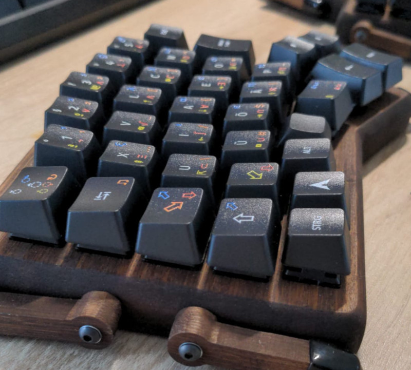

# zmk-config

This is a custom layout for my wireless split Redox keyboard.

My OS is set to neo2. There are layers to type neo2 when OS is set differently.

See [config/redox.keymap](config/redox.keymap) for details.

Official ZMK docs: [https://zmk.dev/docs](https://zmk.dev/docs)

I'm using nRFMicro 1.3.

## Firmware upgrades

Firmware files are available for 90 days as [action artifacts](https://github.com/choopm/zmk-config/actions/workflows/build.yml).

Connect a cable, put both halves into bootloader mode and copy the uf2 files to MSD.

When just updating keymaps only the left half needs to be reflashed.

## Building locally

There is a [Taskfile](Taskfile.yml) included which allows building locally
inside a dev container started using the provided configuration.

## FAQ

* How to see the battery level of the second half?
* * [zmkbat.sh](https://github.com/choopm/dotfiles/blob/main/bin/zmkbat.sh)

## Known issues

### Dongle mode

This includes a configuration for using a
[keyboard dongle](https://zmk.dev/docs/development/hardware-integration/dongle).
Unfortunately this did not work out of the box using a nrf52840_mdk_usb_dongle.

It is unclear at this point what might be the issue.
Probably the peripherals are not pairing with the dongle.
This config remains commented out for now.
